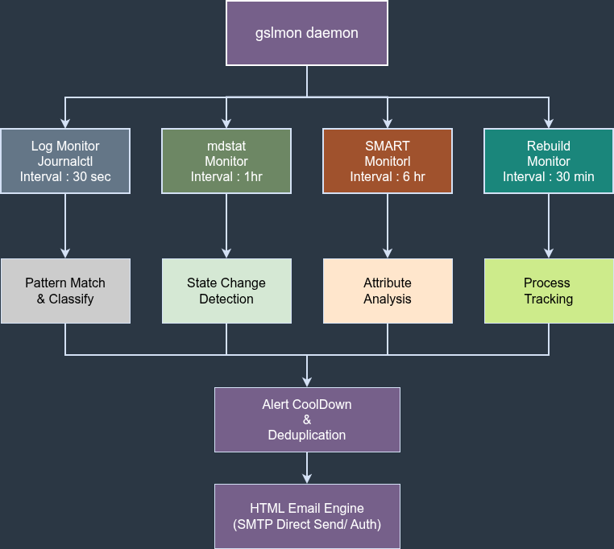

# gslmon — RAID & Disk Health Monitor Daemon

**gslmon** is a lightweight, single-binary daemon written in Go that provides continuous monitoring of Linux RAID arrays and disk health. It watches kernel logs, tracks array state changes, runs periodic SMART self-tests, and delivers richly formatted HTML email alerts when issues arise.

Built for production servers where RAID integrity is critical — from small office NAS boxes to enterprise hypervisors running dozens of virtual machines.

```
Copyright (C) 2026 GetSetLive Pvt Ltd
Source Code Free to Distribute under GPL v3 License
```

---

## Table of Contents

- [Key Features](#key-features)
- [Architecture Overview](#architecture-overview)
- [Monitoring Modules](#monitoring-modules)
  - [Kernel Log Monitor](#1-kernel-log-monitor)
  - [mdstat Array Monitor](#2-mdstat-array-monitor)
  - [SMART Health Monitor](#3-smart-health-monitor)
  - [Rebuild Progress Monitor](#4-rebuild-progress-monitor)
- [Email Alert System](#email-alert-system)
- [State Management](#state-management)
- [Configuration Reference](#configuration-reference)
  - [Email Configuration](#email-configuration)
  - [RAID Configuration](#raid-configuration)
  - [Monitoring Configuration](#monitoring-configuration)
  - [Runtime Paths](#runtime-paths)
- [Supported RAID Types](#supported-raid-types)
- [Recognized Error Patterns](#recognized-error-patterns)
- [SMART Critical Attributes](#smart-critical-attributes)
- [Prerequisites](#prerequisites)
- [Automated Installer (Recommended)](#automated-installer-recommended)
  - [Bash Installer](#bash-installer)
  - [Go Self-Installer Binary](#go-self-installer-binary)
  - [What the Installer Does](#what-the-installer-does)
  - [Installer Uninstall](#installer-uninstall)
- [Quick Start (Manual)](#quick-start-manual)
- [Building from Source](#building-from-source)
- [Installation (Manual)](#installation-manual)
- [Systemd Service](#systemd-service)
- [Supported Linux Distributions](#supported-linux-distributions)
- [Troubleshooting](#troubleshooting)
- [License](#license)

---

## Key Features

- **Four Independent Monitoring Modules** — kernel log scanning, mdstat polling, SMART health checking, and rebuild progress tracking all run as concurrent goroutines
- **Software RAID (mdadm) Support** — monitors `/proc/mdstat` and `mdadm --detail` for array state transitions (clean, degraded, recovering, inactive)
- **Hardware RAID (MegaRAID) Support** — accesses SMART data through megaraid pass-through (`smartctl -d megaraid,N`) for Dell PERC, Broadcom, and LSI controllers
- **Intelligent State Change Filtering** — suppresses noise from harmless `clean <-> active` state toggling while alerting on real degradation events
- **HTML Email Alerts** — professionally formatted emails with severity badges, progress bars, raw command output, and recommended remediation actions
- **SMART Self-Test Automation** — periodically initiates `smartctl --test=long` on all member disks and tracks completion across check cycles
- **Critical SMART Attribute Monitoring** — watches configurable attribute IDs (Reallocated Sectors, Pending Sectors, Uncorrectable Errors, etc.) for non-zero raw values
- **Rebuild Progress Tracking** — sends periodic progress emails during array rebuilds with visual progress bars, ETA, and speed metrics, plus a completion notification
- **Alert Cooldown** — configurable deduplication window prevents email flooding during sustained error conditions
- **PID File Locking** — prevents duplicate daemon instances with stale PID detection
- **State Persistence** — survives daemon restarts by persisting last check times, array state, and SMART test status to a JSON state file
- **Startup Health Report** — sends a comprehensive system health email on every daemon start, including array state and SMART identity for all member disks
- **Single Binary, Zero Dependencies** — compiles to a static Go binary with no runtime dependencies beyond standard Linux utilities (`journalctl`, `smartctl`, `mdadm`)
- **Fully Config-Driven** — all parameters (intervals, patterns, thresholds, email settings, disk topology) are read from a single JSON configuration file

---

## Architecture Overview



---

## Monitoring Modules

### 1. Kernel Log Monitor

Periodically scans kernel messages via `journalctl -k` for patterns matching known RAID and disk failure signatures.

**How it works:**
- Every `log_check_interval_seconds` (default: 30s), fetches kernel log entries since the last check
- Compiles all configured `log_patterns` into regular expressions (case-insensitive)
- Scans each log line against every pattern, stopping at the first match per line
- Classifies matched entries into severity levels: **CRITICAL**, **WARNING**, or **INFO**
- Groups matches by pattern and sends a single consolidated alert email
- Includes human-readable explanations for each error pattern (e.g., "NCQ" -> "Native Command Queuing error. The drive's command queue encountered an issue processing parallel I/O requests.")

**Severity Classification:**

| Level | Patterns |
|-------|----------|
| CRITICAL | `DID_BAD_TARGET`, `Disk failure`, `faulty`, `journal abort`, `disable device`, `super_written`, `I/O error` |
| WARNING | `degraded`, `hardreset`, `frozen`, `NCQ`, `FPDMA`, `hard resetting link`, `Uncorrectable`, `Current_Pending`, `Reallocated` |
| INFO | All other matched patterns |

**Alert email includes:**
- Severity badge and match count
- Grouped alerts by pattern with explanations
- Raw log lines for each match
- The exact `journalctl` command used (so you can reproduce on the server)
- Recommended remediation commands

---

### 2. mdstat Array Monitor

Polls `/proc/mdstat` and `mdadm --detail` to detect RAID array state transitions.

**How it works:**
- Every `mdstat_check_interval_seconds` (default: 3600s / 1 hour), reads `/proc/mdstat`
- Parses the array state, disk status string (e.g., `[UUUU]` or `[U_UU]`), and active/total disk counts
- Also runs `mdadm --detail` to get the authoritative state string (clean, active, degraded, recovering, etc.)
- Compares current state against the last known state stored in the state file
- Uses **significance filtering** to avoid alerting on harmless `clean <-> active` toggles:
  - The `clean` state means the array is idle/synced
  - The `active` state means there are pending writes
  - Only qualifier changes (degraded, recovering, resyncing, etc.) or disk status changes trigger alerts

**State format:** `arrayState|diskStatus|active/total`
- Example healthy: `clean|UUUU|4/4`
- Example degraded: `active, degraded|U_UU|3/4`
- Example recovering: `active, degraded, recovering|U_UU|3/4`

**Alert email includes:**
- Previous vs current state comparison
- Array state, disk status string, active/total counts
- Rebuild status (if recovering)
- Raw `/proc/mdstat` output
- Full `mdadm --detail` output

---

### 3. SMART Health Monitor

Manages periodic SMART long self-tests and monitors critical disk attributes.

**How it works:**
- Every `smart_check_interval_hours` (default: 6h), checks all member disks
- If `smart_test_interval_days` (default: 2) has elapsed since the last test, initiates `smartctl --test=long` on all disks
- Tracks test lifecycle — detects when in-progress tests complete
- Parses full `smartctl -a` output for each disk:
  - **Health status**: PASSED / FAILED
  - **SMART attributes table**: extracts ID, name, value, worst, threshold, raw value
  - **Self-test log**: extracts recent test results (completed, in progress, aborted, error)
- Checks configured `smart_critical_attribute_ids` for non-zero raw values
- Generates a comprehensive HTML report email with per-disk details

**For each disk, the report shows:**
- Model, serial number, and overall health assessment
- Critical attributes table with value/worst/threshold/raw columns and OK/ALERT status
- Last 5 self-test results
- Full `smartctl -a` output for any disk with issues
- Verification commands to run manually

---

### 4. Rebuild Progress Monitor

Tracks RAID array rebuild operations and provides periodic progress updates.

**How it works:**
- Every `rebuild_check_interval_minutes` (default: 30min), checks if a rebuild is active
- Parses recovery/resync progress from `/proc/mdstat` regex: `(recovery|resync) = XX.X%`
- Extracts percentage, ETA, and rebuild speed
- Tracks state transitions:
  - **Not rebuilding -> Rebuilding**: begins sending progress emails
  - **Rebuilding -> Rebuilding**: sends progress update with current percentage
  - **Rebuilding -> Not rebuilding**: sends a **rebuild complete** notification

**Progress email includes:**
- Visual HTML progress bar (CSS-styled, proportional width)
- Percentage complete, ETA, and rebuild speed
- Array state and disk status
- Raw `/proc/mdstat` output

**Completion email includes:**
- Confirmation badge ("COMPLETE")
- Final array state (should be clean/active with all disks UP)
- Full `mdadm --detail` output
- Raw `/proc/mdstat` output

---

## Email Alert System

All emails are sent as HTML with a consistent professional theme:

- **Dark blue header** with server name and array identifier
- **Section titles** with blue underlines
- **Severity badges**: CRITICAL (grey), WARNING (light grey), INFO (blue)
- **Monospace log blocks** with left border accent for raw output
- **Command blocks** showing exact commands to reproduce checks
- **Data tables** with alternating row colors
- **Footer** with daemon identifier and report timestamp

**Email types sent by gslmon:**

| Email Type | Trigger | Severity |
|------------|---------|----------|
| Startup Report | Daemon starts | INFO |
| Log Alert | Kernel log pattern match | CRITICAL / WARNING / INFO |
| mdstat State Change | Array state transition | CRITICAL / WARNING / INFO |
| SMART Health Report | Periodic check cycle | CRITICAL (issues) / INFO (all OK) |
| Rebuild Progress | Active rebuild detected | INFO |
| Rebuild Complete | Rebuild finishes | INFO |

**SMTP Configuration:**
- Connects directly to the configured SMTP server (no authentication required — designed for local/relay SMTP)
- Sends HELO with the configured `server_name`
- Sets `X-Mailer: gslmon/1.0` header
- Uses RFC 1123Z date format

---

## State Management

gslmon persists its state to a JSON file (`state_file` in config) to survive restarts:

```json
{
    "last_log_check": "2026-02-15T10:30:00+05:30",
    "last_mdstat_state": "clean|UUUU|4/4",
    "last_smart_test": "2026-02-14T06:00:00+05:30",
    "smart_test_active": false,
    "rebuild_was_active": false,
    "last_rebuild_pct": "",
    "last_alert_times": {
        "log_alert": "2026-02-15T09:15:00+05:30",
        "mdstat_change": "2026-02-13T22:00:00+05:30"
    }
}
```

**State fields:**
- `last_log_check` — timestamp of last journalctl query (prevents re-scanning old logs)
- `last_mdstat_state` — last known array state string (for change detection)
- `last_smart_test` — when the last SMART long test was initiated
- `smart_test_active` — whether a SMART test is currently in progress
- `rebuild_was_active` — tracks rebuild state for completion detection
- `last_rebuild_pct` — last reported rebuild percentage
- `last_alert_times` — per-alert-type timestamps for cooldown enforcement

State is written atomically (write to `.tmp`, then rename) to prevent corruption.

---

## Configuration Reference

All configuration is read from a single JSON file passed as a command-line argument.

### Email Configuration

| Key | Type | Description | Example |
|-----|------|-------------|---------|
| `smtp_server` | string | SMTP relay hostname | `"mail.example.com"` |
| `smtp_port` | int | SMTP port | `25` or `587` |
| `from` | string | Sender email address | `"gslmon@server.example.com"` |
| `to` | string | Recipient email address | `"alerts@example.com"` |
| `server_name` | string | Server identifier (used in HELO and email subjects) | `"prod-db-01.example.com"` |

### RAID Configuration

| Key | Type | Description | Example |
|-----|------|-------------|---------|
| `array_device` | string | MD array device path (empty for HW RAID only) | `"/dev/md1"` |
| `array_name` | string | Array name as shown in `/proc/mdstat` | `"md1"` |
| `raid_level` | string | RAID level description | `"raid10"` |
| `mount_point` | string | Filesystem mount point | `"/data"` |
| `member_disks` | array | List of monitored disks (see below) | — |

**member_disks[] entry:**

| Key | Type | Description | Example |
|-----|------|-------------|---------|
| `device` | string | Device path for smartctl | `"/dev/sdc"` |
| `type` | string | SMART device type (empty for direct access) | `""` or `"megaraid,0"` |
| `name` | string | Human-readable name for reports | `"sdc"` or `"Disk 0"` |

### Monitoring Configuration

| Key | Type | Default | Description |
|-----|------|---------|-------------|
| `log_check_interval_seconds` | int | 30 | Kernel log scan frequency |
| `mdstat_check_interval_seconds` | int | 3600 | `/proc/mdstat` poll frequency |
| `smart_test_interval_days` | int | 2 | Days between SMART long self-tests |
| `smart_check_interval_hours` | int | 6 | Hours between SMART attribute checks |
| `rebuild_check_interval_minutes` | int | 30 | Rebuild progress check frequency |
| `alert_cooldown_minutes` | int | 15 | Minimum minutes between repeated alerts of the same type |
| `log_patterns` | string[] | (see below) | Regex patterns to match in kernel logs |
| `smart_critical_attribute_ids` | int[] | (see below) | SMART attribute IDs flagged as critical |

### Runtime Paths

| Key | Type | Description | Example |
|-----|------|-------------|---------|
| `log_file` | string | Daemon log file path | `"/var/log/gslmon/gslmon.log"` |
| `state_file` | string | Persistent state file path | `"/var/lib/gslmon/state.json"` |
| `tmp_dir` | string | Temporary file directory | `"/var/lib/gslmon/tmp"` |
| `pid_file` | string | PID lock file path | `"/var/run/gslmon/gslmon.pid"` |

---

## Supported RAID Types

### Software RAID (mdadm)

Full support with all four monitoring modules active:

```json
{
    "raid": {
        "array_device": "/dev/md1",
        "array_name": "md1",
        "raid_level": "raid10",
        "mount_point": "/data",
        "member_disks": [
            {"device": "/dev/sdc", "name": "sdc"},
            {"device": "/dev/sdd", "name": "sdd"},
            {"device": "/dev/sde", "name": "sde"},
            {"device": "/dev/sdf", "name": "sdf"}
        ]
    }
}
```

### Hardware RAID (MegaRAID / Dell PERC)

When `array_device` is empty, mdstat and rebuild monitors are disabled. Only log monitoring and SMART health (via megaraid pass-through) are active:

```json
{
    "raid": {
        "array_device": "",
        "array_name": "",
        "raid_level": "PERC H740P (RAID 10)",
        "mount_point": "/data",
        "member_disks": [
            {"device": "/dev/bus/0", "type": "megaraid,0", "name": "Disk 0"},
            {"device": "/dev/bus/0", "type": "megaraid,1", "name": "Disk 1"},
            {"device": "/dev/bus/0", "type": "megaraid,2", "name": "Disk 2"},
            {"device": "/dev/bus/0", "type": "megaraid,3", "name": "Disk 3"}
        ]
    }
}
```

---

## Recognized Error Patterns

gslmon ships with 26 default kernel log patterns covering the full RAID/disk failure spectrum:

| Pattern | Explanation |
|---------|-------------|
| `DID_BAD_TARGET` | SCSI host byte indicating SATA target not responding |
| `I/O error` | Data read/write failed on disk |
| `degraded` | RAID array running with fewer active disks |
| `Disk failure` | mdadm detected a disk failure |
| `faulty` | Disk marked faulty and removed from array |
| `removed` | Disk removed from RAID array |
| `hardreset` | Kernel performing hard reset on SATA link |
| `frozen` | NCQ command queue frozen |
| `NCQ` | Native Command Queuing error |
| `ata[0-9].*error` | ATA subsystem error on SATA device |
| `ata[0-9].*exception` | ATA exception on SATA device |
| `md/raid` | MD RAID subsystem event |
| `super_written` | Error writing RAID superblock |
| `journal abort` | ext4 journal aborted due to I/O errors |
| `EXT4-fs.*error` | ext4 filesystem error on array |
| `SMART.*error` | SMART subsystem reported error |
| `Reallocated` | Bad sectors remapped to spare area |
| `Uncorrectable` | Uncorrectable read errors detected |
| `Current_Pending` | Sectors pending reallocation |
| `read error` | Read operation failed |
| `write error` | Write operation failed |
| `recovering` | RAID array rebuilding data |
| `disable device` | Kernel disabled a SATA device entirely |
| `FPDMA` | First-party DMA command timeout |
| `hard resetting link` | Hard reset on SATA physical link |
| `link is slow` | SATA link responding slowly after reset |

All patterns are configurable — add, remove, or modify via the `log_patterns` array in config.

---

## SMART Critical Attributes

Default monitored SMART attribute IDs with non-zero raw value alerting:

| ID | Attribute Name | Significance |
|----|---------------|--------------|
| 5 | Reallocated Sectors Count | Bad sectors remapped to spare area — increasing count indicates drive degradation |
| 10 | Spin Retry Count | Drive needed multiple attempts to spin up — motor or power issue |
| 171 | SSD Program Fail Count | Flash programming failures on SSD |
| 172 | SSD Erase Fail Count | Flash erase failures on SSD |
| 184 | End-to-End Error | Data path integrity errors between drive cache and host |
| 187 | Reported Uncorrectable Errors | Errors that ECC could not correct |
| 188 | Command Timeout | Commands that timed out — communication or firmware issue |
| 197 | Current Pending Sector Count | Sectors waiting to be remapped on next write |
| 198 | Offline Uncorrectable | Sectors that failed during offline testing |
| 199 | UDMA CRC Error Count | Cable or interface communication errors |
| 201 | Soft Read Error Rate | Read errors corrected by firmware — high counts indicate degradation |

Configurable via the `smart_critical_attribute_ids` array in config.

---

## Prerequisites

| Dependency | Purpose | Required |
|------------|---------|----------|
| Go 1.21+ | Compilation only (not needed at runtime) | Build time |
| smartmontools | Provides `smartctl` for disk health queries | Runtime |
| mdadm | Software RAID management and detail queries | Runtime (software RAID only) |
| systemd | Provides `journalctl` for kernel log access | Runtime |
| SMTP server | Relay for sending alert emails | Runtime |

---

## Automated Installer (Recommended)

The easiest way to deploy gslmon is using the automated installer, which handles everything — dependency installation, RAID detection, configuration, compilation, and service setup.

### Bash Installer

```bash
git clone https://github.com/hawkeye4iot/gslmon.git
cd gslmon
sudo bash installer/gslmon-installer.sh
```

The installer will guide you through an interactive setup:

```
========================================
  gslmon Installer
  RAID & Disk Health Monitor Daemon
  Copyright (C) 2026 GetSetLive Pvt Ltd
========================================

[STEP]  === Phase 1: Dependencies ===
[OK]    smartmontools already installed (smartctl 7.3)
[OK]    mdadm already installed (mdadm - v4.2)
[OK]    Go 1.22 already installed (>= 1.21 required)

[STEP]  === Phase 2: RAID Detection ===
[OK]    Detected software RAID: /dev/md1 (raid10) on /data
[INFO]    Members: /dev/sdc /dev/sdd /dev/sde /dev/sdf

[STEP]  === Phase 3: Email Configuration ===
SMTP server hostname [localhost]: mail.example.com
SMTP port [25]: 25
Sender email (from) [gslmon@server.example.com]:
Alert recipient email (to): alerts@example.com
Server name for email subjects [server.example.com]:

[STEP]  === Phase 4: Installation ===
[OK]    Directories created
[OK]    Configuration written to /etc/gslmon/config.json
[OK]    Compilation successful
[OK]    Binary installed to /usr/local/bin/gslmon
[OK]    Service installed as gslmon.service

========================================
  gslmon Installation Complete
========================================

Start gslmon now? [Y/n]: Y
[OK]    gslmon is running! Startup health email sent to alerts@example.com
```

### Go Self-Installer Binary

For environments where you prefer a pre-compiled installer binary (no bash dependency):

```bash
# Build the installer binary on any machine with Go
cd gslmon/installer
go build -ldflags="-s -w" -o gslmon-installer gslmon-installer.go

# Copy to target server and run
scp gslmon-installer root@target-server:/tmp/
ssh root@target-server
cd /tmp
# Ensure the gslmon source repo is available on the target
git clone https://github.com/hawkeye4iot/gslmon.git
cd gslmon
/tmp/gslmon-installer
```

Or run directly from the cloned repo:

```bash
git clone https://github.com/hawkeye4iot/gslmon.git
cd gslmon/installer
go build -ldflags="-s -w" -o gslmon-installer gslmon-installer.go
sudo ./gslmon-installer
```

### What the Installer Does

The installer performs the following steps automatically:

| Phase | Action | Details |
|-------|--------|---------|
| **1. OS Detection** | Identifies Linux distribution | Supports Ubuntu, Debian, RHEL, CentOS, AlmaLinux, Rocky, Fedora, openSUSE, Arch |
| **2. Package Manager** | Auto-detects package manager | dnf, yum, apt-get, zypper, pacman |
| **3. smartmontools** | Installs if missing | Required for SMART disk health monitoring |
| **4. mdadm** | Installs if missing | Required for software RAID monitoring |
| **5. Go Compiler** | Checks version, installs if needed | Tries package manager first; downloads official tarball from go.dev if distro version < 1.21 |
| **6. RAID Detection** | Auto-detects RAID topology | Reads `/proc/mdstat` and `mdadm --detail` for software RAID; scans `smartctl --scan` for MegaRAID hardware RAID; falls back to individual disk detection via `lsblk` |
| **7. Email Setup** | Interactive SMTP configuration | Prompts for SMTP server, port, sender, recipient, and server name |
| **8. Config Generation** | Creates `/etc/gslmon/config.json` | Auto-populated with detected RAID array, member disks, and email settings |
| **9. Compilation** | Builds gslmon from source | Compiles with `-ldflags="-s -w"` for optimized binary size |
| **10. Service Install** | Deploys systemd service | Installs `gslmon.service`, runs `daemon-reload`, optionally starts and enables |

**RAID Auto-Detection supports:**
- **Software RAID (mdadm)**: Parses `/proc/mdstat` for active arrays, extracts array name, RAID level, mount point, and all member disk devices
- **Hardware RAID (MegaRAID)**: Scans `smartctl --scan` output for megaraid pass-through devices (Dell PERC, Broadcom, LSI controllers)
- **Individual Disks**: If no RAID is found, enumerates physical disks via `lsblk` for SMART-only monitoring

**Go Compiler Provisioning:**
- Checks if `go` exists in PATH or at `/usr/local/go/bin/go`
- Validates version is >= 1.21
- Tries distro package manager first (fastest)
- Falls back to downloading the official Go tarball from `https://go.dev/dl/`
- Installs to `/usr/local/go` and adds to system PATH via `/etc/profile.d/golang.sh`
- Supports x86_64 (amd64), aarch64 (arm64), and armv7l architectures

### Installer Uninstall

Both installers support clean removal:

```bash
# Bash installer
sudo bash installer/gslmon-installer.sh --uninstall

# Go installer binary
sudo ./gslmon-installer --uninstall
```

This will:
- Stop and disable the gslmon systemd service
- Remove the service unit file
- Remove the binary from `/usr/local/bin/`
- Remove log, state, and PID directories
- Preserve `/etc/gslmon/config.json` (remove manually if needed)

---

## Quick Start (Manual)

If you prefer manual installation without the automated installer:

```bash
# Clone
git clone https://github.com/hawkeye4iot/gslmon.git
cd gslmon

# Build
go build -ldflags="-s -w" -o gslmon main.go

# Configure
sudo mkdir -p /etc/gslmon /var/log/gslmon /var/lib/gslmon/tmp /var/run/gslmon
sudo cp config.json.example /etc/gslmon/config.json
sudo vi /etc/gslmon/config.json    # Edit email, RAID, and disk settings

# Run manually (foreground)
sudo ./gslmon /etc/gslmon/config.json

# Or install as a service
sudo cp gslmon /usr/local/bin/
sudo cp gslmon.service /etc/systemd/system/
sudo systemctl daemon-reload
sudo systemctl enable --now gslmon
```

---

## Building from Source

```bash
# Standard build
go build -o gslmon main.go

# Optimized build (smaller binary, stripped debug symbols)
go build -ldflags="-s -w" -o gslmon main.go

# Cross-compile for ARM64 (e.g., Raspberry Pi, ARM servers)
GOOS=linux GOARCH=arm64 go build -ldflags="-s -w" -o gslmon-arm64 main.go

# Verify
./gslmon
# Output: Usage: gslmon <config.json>
```

---

## Installation (Manual)

See the [INSTALL](INSTALL) file for detailed step-by-step instructions including:
- Go compiler installation for each distribution
- Binary compilation and placement
- Configuration file setup
- Runtime directory creation
- Systemd service installation
- Uninstallation steps

---

## Systemd Service

The included `gslmon.service` file runs gslmon as a systemd-managed daemon:

```ini
[Service]
Type=simple
ExecStart=/usr/local/bin/gslmon /etc/gslmon/config.json
Restart=always
RestartSec=15
```

**Common commands:**
```bash
sudo systemctl start gslmon       # Start the daemon
sudo systemctl stop gslmon        # Stop the daemon
sudo systemctl restart gslmon     # Restart (sends new startup email)
sudo systemctl status gslmon      # Check running status
sudo systemctl enable gslmon      # Enable auto-start on boot
journalctl -u gslmon -f           # Follow systemd journal output
```

---

## Supported Linux Distributions

gslmon compiles and runs on any Linux distribution with Go 1.21+, systemd, and smartmontools:

| Distribution | Versions Tested | Install Go |
|-------------|-----------------|------------|
| Ubuntu | 20.04, 22.04, 24.04 | `apt install golang-go` |
| Debian | 11, 12 | `apt install golang-go` |
| RHEL | 8, 9 | `dnf install golang` |
| CentOS Stream | 8, 9 | `dnf install golang` |
| AlmaLinux | 8, 9 | `dnf install golang` |
| Rocky Linux | 8, 9 | `dnf install golang` |
| Fedora | 38, 39, 40 | `dnf install golang` |
| openSUSE | Leap 15.x, Tumbleweed | `zypper install go` |
| Arch Linux | Rolling | `pacman -S go` |

---

## Troubleshooting

**Daemon won't start — "already running with PID X"**
- A previous instance is still running, or a stale PID file exists
- Check: `ps aux | grep gslmon`
- If the process is dead, remove the stale PID file and retry

**No emails received**
- Verify SMTP connectivity: `telnet your-smtp-server 25`
- Check the gslmon log file for SMTP errors
- Ensure the `from` address is permitted by your SMTP relay

**mdstat alerts for every check (clean/active toggling)**
- This should be suppressed by the significance filter
- Verify you are running the latest version with `isSignificantStateChange()`

**SMART test never completes**
- Long tests on large disks can take 4-8+ hours
- Check progress: `smartctl -l selftest /dev/sdX`
- gslmon tracks completion automatically across check cycles

**High CPU or memory usage**
- gslmon is designed to be lightweight (typically <10MB RSS)
- If log checking is too frequent, increase `log_check_interval_seconds`

---

## License

This project is licensed under the **GNU General Public License v3.0**.

```
Copyright (C) 2026 GetSetLive Pvt Ltd
Source Code Free to Distribute under GPL License
```

See the [LICENSE](LICENSE) file for the complete license text.
